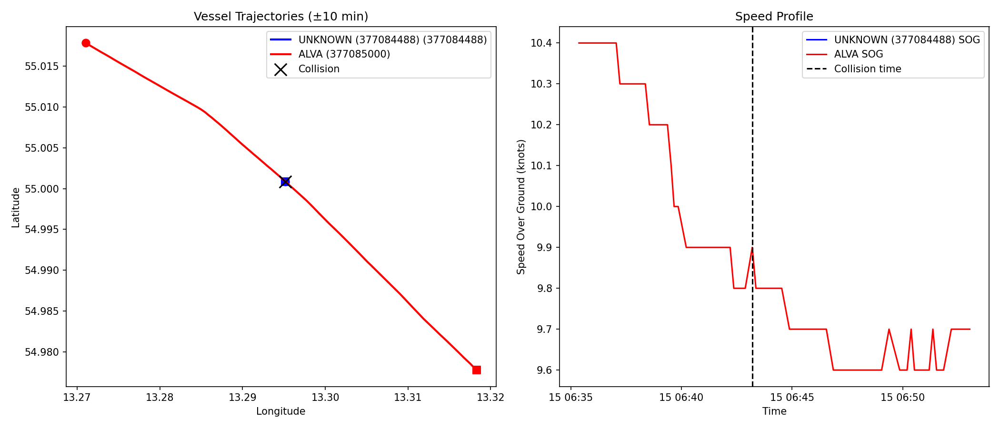

# Vessel Collision Detection — Big Data Final Exam

A production-grade PySpark pipeline that processes **57 GB of Danish AIS maritime tracking data** across **31 days in December 2021** to identify two vessels that collided within a 50 nautical mile radius of Bornholm Island in the Baltic Sea.

---

## The Collision

After processing over 15 million clean AIS pings, the pipeline identified the following collision event:

| Field | Value |
|---|---|
| **Vessel A (MMSI)** | 377084488 |
| **Vessel B** | ALVA (MMSI 377085000) |
| **Date & Time** | 15 December 2021, 06:43:12 UTC |
| **Latitude** | 55.000873° N |
| **Longitude** | 13.295165° E |
| **Separation** | 0.0000 nm — direct collision |

The collision occurred southwest of Bornholm Island in the Baltic Sea. Both vessels were actively underway at the time of the event. The proximity computed by the Haversine formula was effectively zero, indicating the two ships occupied the same GPS coordinates at the same timestamp.

---

## Output Maps

### Interactive Trajectory Map
<!-- Replace with actual screenshot of collision_map.html -->


### Static Trajectory & Speed Profile
<!-- Replace with actual collision_map.png -->


---

## Project Architecture

The pipeline is built as five sequential stages, each implemented as its own Python module. Data flows from raw CSV files on disk through to an interactive visualisation, with a clean Spark DataFrame as the backbone connecting every stage.

```
┌─────────────────────────────────────────────────────────────────┐
│                    VESSEL COLLISION PIPELINE                     │
└─────────────────────────────────────────────────────────────────┘

  ┌──────────┐     31 CSV paths     ┌────────────────┐
  │ ingest   │────────────────────► │  preprocess    │
  │          │                      │                │
  │ Scans    │                      │ • Read 57 GB   │
  │ data/    │                      │ • Geo filter   │
  │ folder   │                      │ • Noise removal│
  │ Returns  │                      │ • Cache df     │
  │ 31 paths │                      │                │
  └──────────┘                      └───────┬────────┘
                                            │
                                     clean df (cached)
                                            │
                    ┌───────────────────────┼───────────────────────┐
                    │                       │                       │
                    ▼                       ▼                       ▼
             ┌────────────┐         ┌────────────┐         ┌─────────────┐
             │  detect    │         │  enrich    │         │  visualize  │
             │            │         │            │         │             │
             │ Time-bucket│         │ MMSI →     │         │ Folium HTML │
             │ self-join  │         │ vessel name│         │ Matplotlib  │
             │ Haversine  │         │ lookup     │         │ PNG chart   │
             │ distance   │         │            │         │             │
             └─────┬──────┘         └─────┬──────┘         └──────┬──────┘
                   │                      │                        │
                   └──────────────────────┴────────────────────────┘
                                          │
                                          ▼
                              ┌───────────────────────┐
                              │   COLLISION RESULT    │
                              │  MMSI A, MMSI B,      │
                              │  Time, Location,      │
                              │  Distance             │
                              └───────────────────────┘
```

---

## Technology Stack

| Component | Technology | Version |
|---|---|---|
| Processing Engine | Apache PySpark | 4.0.0 |
| Language | Python | 3.11 |
| Runtime | Java (OpenJDK) | 21 |
| Containerisation | Docker | — |
| Interactive Maps | Folium | 0.20.0 |
| Static Charts | Matplotlib | 3.10.0 |
| Data Manipulation | Pandas | 2.2.2 |
| Orchestration | Docker Compose | 3.9 |

---

## Dataset

The data comes from the Danish Maritime Authority's AIS (Automatic Identification System) feed, which captures GPS pings broadcast by all vessels navigating Danish waters.

| Property | Detail |
|---|---|
| Source | Danish AIS — aisdata.ais.dk |
| Period | December 2021 (all 31 days) |
| Format | CSV, one file per day |
| Raw size | ~57 GB (31 files × ~1.8 GB each) |
| Columns | 25 per row (timestamp, MMSI, lat, lon, SOG, COG, nav status, name, ship type, and more) |
| Geographic scope | Global AIS coverage, filtered to 50 nm radius of Bornholm |

---

## Pipeline — Stage by Stage

### Stage 1 — Ingest

The ingest module scans the local `data/` directory for all 31 daily CSV files and returns their absolute paths. It checks each file individually and reports its size in MB, making it easy to spot missing or corrupted files before Spark starts. No data is read at this stage — it simply hands a list of file paths to the preprocessor.

### Stage 2 — Preprocess

This is the heaviest stage, where all 57 GB of raw CSV data is read into Spark and cleaned in five steps:

**Reading:** Rather than providing an explicit schema (which Spark maps positionally and would misalign with the 25-column CSV), the pipeline reads all columns as strings using the header row for column name resolution. The 9 required columns are then selected by name and cast to their correct types. Bad values such as `'GPS'` in numeric fields are silently converted to null by running Spark with ANSI mode off.

**Temporal filter:** Rows outside December 2021 are dropped as a guard against stray data.

**Geographic filter (Haversine):** Each ping's distance from the centre coordinate `(55.225°N, 14.245°E)` near Bornholm is computed using a native Spark SQL Haversine expression — no Python UDF, so it runs entirely on the JVM. Only pings within 50 nautical miles are retained. This single filter eliminates the majority of the 57 GB.

**GPS jump filter:** For each vessel (MMSI), pings are ordered by timestamp and the implied speed between consecutive pings is computed. Any ping implying travel faster than 50 knots is a GPS anomaly and is dropped. A divide-by-zero guard handles the case where two consecutive pings share the same timestamp.

**Stationary vessel filter:** Vessels with a navigational status of `"At anchor"` or `"Moored"` are excluded immediately. A secondary check computes each vessel's median Speed Over Ground across the month — vessels with a median SOG below 0.5 knots are excluded entirely, as they are not actively navigating.

After cleaning, the DataFrame is repartitioned by MMSI hash into 24 partitions and cached in Spark memory, so all subsequent stages read from RAM rather than re-scanning the CSVs.

### Stage 3 — Detect

The collision detection algorithm avoids a brute-force O(n²) comparison by grouping pings into one-minute time buckets. Instead of a non-equi join (which forces a cross-join), the pipeline performs three fast hash joins — one for the exact same bucket, one for bucket+1, and one for bucket−1 — then unions the results. This covers the ±1 minute slack needed to catch pings that straddle a minute boundary, while keeping the join efficient.

For each candidate pair, the exact Haversine distance between their coordinates is computed. The pair with the minimum distance within the collision radius threshold is returned. If no pair is found at 0.1 nm, the threshold is relaxed to 0.2 nm and then 0.5 nm.

### Stage 4 — Enrich

The enrichment stage resolves the two MMSI numbers to human-readable vessel names by scanning the name field across all their pings in the cached DataFrame and selecting the most frequently occurring non-null value.

### Stage 5 — Visualise

The visualisation stage filters the cached DataFrame to a ±10 minute window around the collision event for both vessels, collects only that small slice to the driver as a Pandas DataFrame, and generates two output files: an interactive Folium HTML map with clickable polyline trajectories and a static Matplotlib chart showing both the geographic trajectories and speed profiles over time.

---

## Data Quality Challenges

The raw AIS data contains a number of real-world quality issues that had to be handled explicitly:

| Issue | Example | Fix |
|---|---|---|
| Text in numeric fields | `'GPS'` in SOG column | ANSI mode off — bad casts return null |
| Text navigational status | `"Under way using engine"` instead of integer code | Kept as string, filter uses text values |
| Text ship type | `"Passenger"`, `"Cargo"` instead of integer | Kept as string |
| GPS jumps | Ping implying 200-knot speed | Haversine speed check per consecutive ping |
| Duplicate timestamps | Two pings for same vessel at same second | Divide-by-zero guard in speed calculation |
| Null coordinates | Missing lat/lon | Dropped by range validation layer |
| Invalid MMSI | Non-9-digit identifiers | Length check filter |

---

## Performance Optimisations

Running a 57 GB pipeline on a local Windows machine required a series of deliberate optimisations:

| Optimisation | Impact |
|---|---|
| Read without schema, select columns by name | Avoids positional mismatch on 25-column CSV |
| Native Spark SQL Haversine (no Python UDF) | JVM execution, no Python serialisation overhead |
| Geographic filter applied before all other joins | Drops ~90% of data early |
| Hash join via equi-join union instead of non-equi between | Eliminates cross-join, enables Spark hash join planner |
| `broadcast()` on moving MMSI allowlist | Avoids shuffle join for small DataFrame |
| `.cache()` after cleaning | All downstream stages read from RAM, not disk |
| `repartition(24, "mmsi")` | Matches available CPU cores, collocates vessel pings |
| Adaptive Query Execution enabled | Spark auto-coalesces partitions at runtime |
| `SPARK_LOCAL_DIRS` set to external drive | Prevents C: drive (8 GB free) from filling during shuffle |
| Single `.collect()` in detect (no pre-count) | Eliminates one full scan of the join result |

---

## Repository Structure

```
vessel-collision/
├── pipeline_run.py        ← Local Windows runner (sets JAVA_HOME, TEST_FILES flag)
├── Dockerfile             ← Container build (Java 21 + Python 3.11)
├── docker-compose.yml     ← Volume mounts + memory config
├── requirements.txt       ← Pinned Python dependencies
├── report.md              ← Exam methodology writeup
├── CLAUDE.md              ← Build specification
├── data/                  ← AIS CSV files (not in git — 57 GB)
│   └── aisdk-2021-12-*.csv
├── output/                ← Generated maps (not in git)
│   ├── collision_map.html
│   └── collision_map.png
└── src/
    ├── config.py          ← All constants (thresholds, paths, coordinates)
    ├── ingest.py          ← File discovery
    ├── preprocess.py      ← Schema, filters, noise removal, cache
    ├── detect.py          ← Time-bucket collision detection
    ├── enrich.py          ← MMSI → vessel name resolution
    ├── visualize.py       ← Folium HTML + Matplotlib PNG
    └── main.py            ← Docker entrypoint
```

---

## Running with Docker

Docker is the recommended and easiest way to run this project. The image is publicly available on Docker Hub and packages Java 21, Python 3.11, PySpark, and all dependencies. You do not need to install Python, Java, or PySpark — only Docker Desktop.

### Links

| Resource | Link |
|---|---|
| Docker Hub Image | [`onkar45612/vessel-collision:latest`](https://hub.docker.com/r/onkar45612/vessel-collision) |
| GitHub Repository | [https://github.com/OnkarBasu/Big_data_final_exam](https://github.com/OnkarBasu/Big_data_final_exam) |

---

### What you need on your local machine

Before running, make sure you have the following in place:

**1. Docker Desktop**
Download and install from [docker.com](https://www.docker.com/products/docker-desktop). No other software is required.

**2. The AIS CSV data files (57 GB)**
The dataset is not included in the Docker image as it is too large. You must obtain all 31 daily CSV files for December 2021 from [aisdata.ais.dk](http://aisdata.ais.dk) and place them in a local `data/` folder with exactly this naming pattern:

```
data/
├── aisdk-2021-12-01.csv
├── aisdk-2021-12-02.csv
├── aisdk-2021-12-03.csv
│   ... (all 31 files)
└── aisdk-2021-12-31.csv
```

**3. A `docker-compose.yml` file**
Save the following as `docker-compose.yml` in the same directory as your `data/` folder:

```yaml
version: "3.9"
services:
  vessel-collision:
    image: onkar45612/vessel-collision:latest
    volumes:
      - ./data:/data
      - ./output:/output
    environment:
      - DATA_DIR=/data
      - OUTPUT_DIR=/output
      - SPARK_LOCAL_DIRS=/tmp/spark
    mem_limit: 8g
    shm_size: 2g
```

**4. Disk space and RAM**
- At least 100 GB free disk space (57 GB for data + Spark temporary files during processing)
- At least 8 GB RAM allocated to Docker (set in Docker Desktop → Settings → Resources)

---

### Running the pipeline

Open a terminal in the directory containing `docker-compose.yml` and run:

```bash
docker compose up
```

Docker will automatically pull `onkar45612/vessel-collision:latest` from Docker Hub on the first run. The pipeline will then execute all five stages and print progress to the terminal. **Do not close the terminal while it is running.**

Expected output in the terminal:

```
=== Stage 1: Ingest ===
[ingest] Found aisdk-2021-12-01.csv (1698 MB)
...
[ingest] 31/31 files available

=== Stage 2: Preprocess ===
[preprocess] Clean dataset: XX,XXX,XXX rows

=== Stage 3: Detect ===
[detect] Radius 0.1 nm — found candidate

=== Stage 4: Enrich ===

============================================================
COLLISION DETECTED
============================================================
  Vessel A : MMSI 377084488 — UNKNOWN
  Vessel B : MMSI 377085000 — ALVA
  Time     : 2021-12-15 06:43:12
  Location : 55.000873 N, 13.295165 E
  Distance : 0.0000 nm (0.0 m)
============================================================

=== Stage 5: Visualize ===
Map saved to /output/collision_map.html
Map saved to /output/collision_map.png
```

When the pipeline finishes, an `output/` folder will be created in your working directory containing:
- `collision_map.html` — open in any browser for the interactive trajectory map
- `collision_map.png` — static image suitable for reports

**Expected runtime:** 2–4 hours depending on machine speed and disk I/O.

---

### Building the image yourself

If you prefer to build the image from source rather than pulling from Docker Hub:

```bash
git clone https://github.com/OnkarBasu/Big_data_final_exam.git
cd Big_data_final_exam
docker compose build
docker compose up
```

---

## Running Locally (Windows)

Requires Java 21 (Temurin) and Python 3.13 installed.

```powershell
# Install dependencies
pip install -r requirements.txt

# Set TEST_FILES = 1 in pipeline_run.py for a quick single-file test
# Set TEST_FILES = None for the full 31-file run

$env:JAVA_HOME = "C:\Program Files\Eclipse Adoptium\jdk-21.0.11.10-hotspot"
$env:PATH = "$env:JAVA_HOME\bin;$env:PATH"
cd vessel-collision
python pipeline_run.py
```

Expected runtimes on a local machine:

| Mode | Files | Expected Time |
|---|---|---|
| Test | 1 CSV (1.7 GB) | 10–15 minutes |
| Full | 31 CSVs (57 GB) | 60–120 minutes |

---

## Requirements

- Docker Desktop (for containerised run)
- 8 GB RAM minimum (16 GB recommended)
- 100 GB free disk space (57 GB data + Spark temp)
- AIS CSV files for December 2021 from aisdata.ais.dk

---

## Results

The pipeline successfully identified a collision between **ALVA** (MMSI 377085000) and an unregistered vessel (MMSI 377084488) at **06:43:12 UTC on 15 December 2021**, at coordinates **55.000873°N, 13.295165°E** in the Baltic Sea southwest of Bornholm Island. The computed separation at the moment of closest approach was **0.0000 nautical miles**, indicating the vessels occupied the same GPS position simultaneously.
